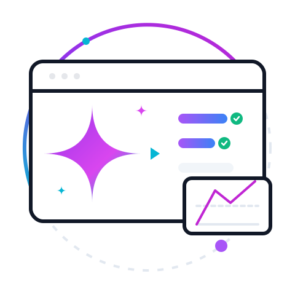

<p align="center">
  <a href="https://codefreex.com/agency-os-ai" target="_blank">
    
  </a>
</p>

<h1 align="center">Agency OS AI</h1>

<p align="center">
  AI-powered WordPress project manager with a branded client portal, employee workspace, support tickets, built-in SMTP, inbound and outbound webhooks, and OpenAI-powered workflow tools.
</p>

<p align="center">
  
  
  
  
</p>

## Why Agency OS AI exists

Agencies should not need five separate SaaS tools just to manage delivery, support, files, client communication, and internal coordination.

Agency OS AI brings those core workflows into WordPress with a modern React admin, a branded frontend portal for clients and employees, reliable built-in SMTP email delivery, inbound and outbound webhook connectivity, and a free-core architecture that is honest about what ships today while staying ready for future add-ons.

## What is included in free core

**Project and task management**

- Projects, task lists, tasks, milestones, messages, files, reports, profile, team, and settings
- Branded React admin workspace with updated header logo and animated preloaders
- Team performance visibility in the reports screen
- **Dynamic workflow stages** - customizable Kanban columns for tasks and tickets
- **Time tracking** - start/stop timers, time entries per task/project, billable hours tracking

**Client and company management**

- **Client management** - full CRM with client profiles, contacts, company details, and project linking
- **Invoice system** - create invoices with line items, tax calculation, payment tracking, and PDF-ready format
- Client-project relationships for organized delivery tracking

**Branded client portal**

- Frontend portal shortcode: `[agency_os_ai_portal]`
- Frontend login shortcode: `[agency_os_ai_login]`
- Client role (`aosai_client`) and employee role (`aosai_employee`)
- Admin bar hiding and frontend-first redirects for portal users
- One-click page creation for login, portal, and support pages
- PWA basics for an installable frontend portal experience
- Searchable ticket inbox with status and department filters
- Rich project visibility cards with task previews, milestone previews, and next-milestone insight
- Personal Kanban board in the portal task view with drag-and-drop status updates
- **Workload planning** - see assigned tasks and capacity across team members

**Help desk and support tickets**

- Support tickets, departments, ticket notes, and reusable dynamic tags
- Department default assignee for automatic ticket routing on new submissions
- **Ticket macros** - pre-built templates for common ticket actions
- **SLA rules** - configurable response time targets by priority level
- AI-assisted department routing baseline when an OpenAI key is present
- AI ticket assist for summary, routing, priority, suggested first reply, and tags

**Email, automation, and support operations**

- Built-in SMTP configuration: host, port, authentication, encryption, all from the Settings screen
- **Dynamic email templates** - customizable notification templates with variable substitution
- Branded email notifications with customizable sender name, sender address, and footer text
- Inbound email-to-ticket webhook endpoint (`POST /aosai/v1/inbound/email`) with token authentication for auto-creating tickets from forwarded emails
- Outbound webhook integrations with HMAC signature verification firing on `ticket.created`, `task.created`, `project.created`, and other key events

**AI tools**

- OpenAI integration using your own API key
- AI playground for direct workspace queries
- AI-assisted ticket department routing
- AI ticket triage assist in the portal
- AI productivity brief in reports
- AI team coach brief in access management
- **AI task generation** - generate complete task lists from project descriptions

**Company branding**

- Company name, logo URL, colors, and portal welcome copy
- Privacy policy and terms URL fields for branded frontend trust links
- Extension-ready email hooks for future provider-specific delivery layers
- Login activity and IP tracking controls for client and employee access auditing

## Shortcodes

| Shortcode | Purpose |
|---|---|
| `[agency_os_ai_portal]` | Full frontend workspace |
| `[agency_os_ai_portal view="tickets"]` | Ticket-focused portal view |
| `[agency_os_ai_login]` | Branded login screen |

## Documentation

For comprehensive documentation, visit [themefreex.com/doc/agency-os-ai](https://themefreex.com/doc/agency-os-ai).

## Development

### Requirements

- WordPress 6.4+
- PHP 8.0+
- Node.js 18+

### Install dependencies

```bash
npm install
```

If you hit an `ERESOLVE` conflict, use:

```bash
npm install --legacy-peer-deps
```

### Typecheck

```bash
npm run typecheck
```

### Build the admin and portal bundles

```bash
npm run build
```

## Architecture snapshot

```text
agency-os-ai/
|- agency-os-ai.php
|- includes/
|  |- api/
|  |- admin/
|  |- frontend/
|  |- helpers/
|  |- models/
|  `- services/
|- src/
|  |- admin/
|  `- portal/
|- templates/
`- build/
```

## Extension philosophy

The free plugin should feel complete and valuable on its own.

If you build add-ons, the best path is to extend the free core through hooks, REST routes, isolated settings, and new asset bundles instead of replacing the portal, settings, or branding systems already in place.

Useful extension surfaces available in free core:

```php
apply_filters( 'aosai_admin_js_data', $data );
do_action( 'aosai_register_pro_routes' );
apply_filters( 'aosai_email_payload', $payload );
apply_filters( 'aosai_pre_send_email', null, $payload );
do_action( 'aosai_before_send_email', $payload );
do_action( 'aosai_after_send_email', $result, $payload );
```

## Branding

Agency OS AI is a product of [Themefreex](https://themefreex.com) by [Codefreex](https://codefreex.com).

The free core includes:

- Product branding in the portal login and workspace footer
- Policy URL settings for privacy and terms links
- Documentation pages with branded product footers

## Coming soon roadmap

These are planned add-on or future expansion areas, not features currently shipped in the free core:

- Advanced multi-project Kanban workflows with WIP controls and swimlanes
- Gantt chart planning for project timelines
- Calendar and workload planning across team members
- Time tracking and billing overlays
- Automated invoicing and payment workflows
- Stripe payment gateway integration
- Multi-provider AI: Claude (Anthropic), Gemini (Google), DeepSeek, xAI Grok, OpenRouter
- Slack team notifications
- GitHub and Bitbucket development pipeline integrations
- BuddyPress and WooCommerce integrations
- Advanced data exports and executive reporting dashboards

## Contributing

Contributions are welcome, especially in these areas:

- Stability improvements across real agency workflows
- Reporting and visualization polish
- Portal accessibility and mobile UX
- Documentation quality
- Extension patterns for future add-ons

When contributing, please keep the docs, README, and actual product behavior aligned.

## License

GPL-2.0-or-later

## Changelog

### 1.5.0 - 2026-03-31
- **Client Management System** - Full CRM with client profiles, company details, contact management, and project linking via REST API
- **Invoice & Billing System** - Create invoices with line items, automatic tax calculation, payment tracking, invoice numbers, and PDF-ready format
- **Dynamic Workflow Stages** - Customizable Kanban columns for tasks and tickets with color coding and reordering
- **Dynamic Email Templates** - Fully customizable notification templates with variable substitution for all events
- **Time Tracking** - Built-in time tracking with start/stop timers, time entries per task and project, billable hours tracking
- **Workload Planning** - Team member capacity visibility and workload distribution across projects
- **Enhanced Kanban** - Improved drag-and-drop functionality with proper project shifting support
- **Ticket Macros & SLA Rules** - Pre-built ticket templates and configurable SLA response targets by priority
- Updated database schema to 1.5.0 with new tables for clients, invoices, workflow stages, email templates, and time entries

### 1.4.3 - 2026-03-31
- Added portal task Kanban board with drag-and-drop status flow and quick status controls.
- Normalized task workflow states so legacy open and done values stay aligned with the Kanban UI.
- Upgraded the portal task board with search, project filters, priority filters, and overdue workload context.
- Added login activity tracking model and API with IP/user-agent capture for client and employee access audits.
- Added login activity controls and live audit feed in Settings > Automation.
- Hardened AI model resolution to always provide a valid fallback model before API requests.
- Hardened portal session IP resolution across common proxy headers for cleaner access auditing.

### 1.4.1 - 2026-03-31
- Guaranteed AI model fallback on every call to prevent "you must provide a model parameter" errors.
- Portal bootstrap now records last portal IP/time and returns session metadata for auditing.
- Version bump for build alignment.

### 1.4.0 - 2026-03-31
- Added AI ticket assist in the frontend portal for summary, priority, department, suggested first reply, and tags
- Added AI team coach brief in access management for live team guidance
- Added searchable mailbox-style portal ticket inbox with status and department filters
- Added richer client project visibility with task previews, milestone previews, and next milestone context
- Expanded client portal task visibility counts so client dashboards reflect public project work more accurately

### 1.3.0 - 2026-03-31
- Added built-in SMTP configuration for reliable email delivery from the Settings screen (host, port, auth, encryption)
- Added inbound email-to-ticket webhook endpoint (POST /aosai/v1/inbound/email) with token authentication for auto-creating tickets from forwarded emails
- Added outbound webhook integrations with HMAC signature verification for 	icket.created, 	ask.created, project.created, and other key events
- Added department default assignee for automatic ticket assignment on new submissions
- Fixed 404 errors on dynamically-imported JS assets caused by incorrect Vite base path; rebuilt with correct relative base
- Fixed admin bar display on portal pages for administrator roles
- Bumped tested-up-to to 6.9

### 1.2.2 - 2026-03-31
- Fixed critical black-screen bug: Vite was building chunk URLs as absolute paths (/assets/...) causing 404s on any WordPress install. Set ase: './' so dynamic imports resolve relative to the entry script via import.meta.url.
- Fixed translation textdomain loading too early: load_plugin_textdomain was registered on plugins_loaded inside code that itself runs on plugins_loaded (already fired), so translations never loaded. Moved hook to init.
- Updated tested-up-to to 6.9.

### 1.2.1 - 2026-03-30
- Fixed a bug that prevented the admin dashboard from loading due to missing JavaScript and CSS assets.
- Regenerated the build files to ensure all assets are up-to-date.
- Released the plugin version to 1.2.1.